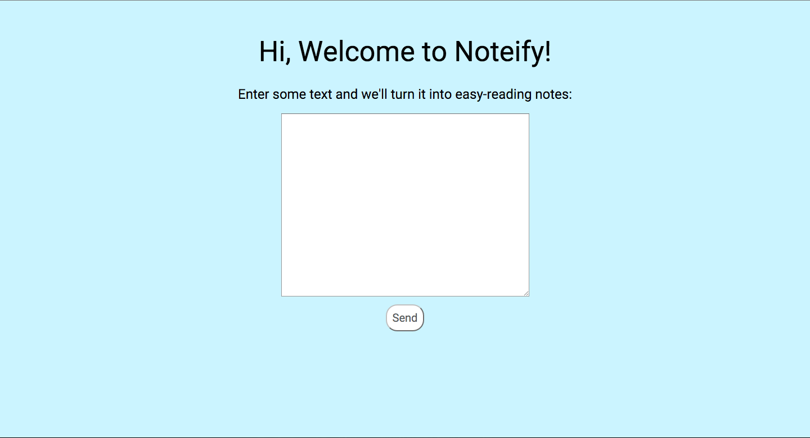
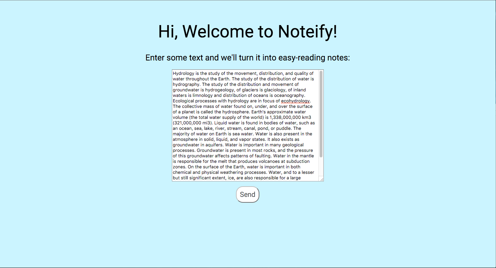
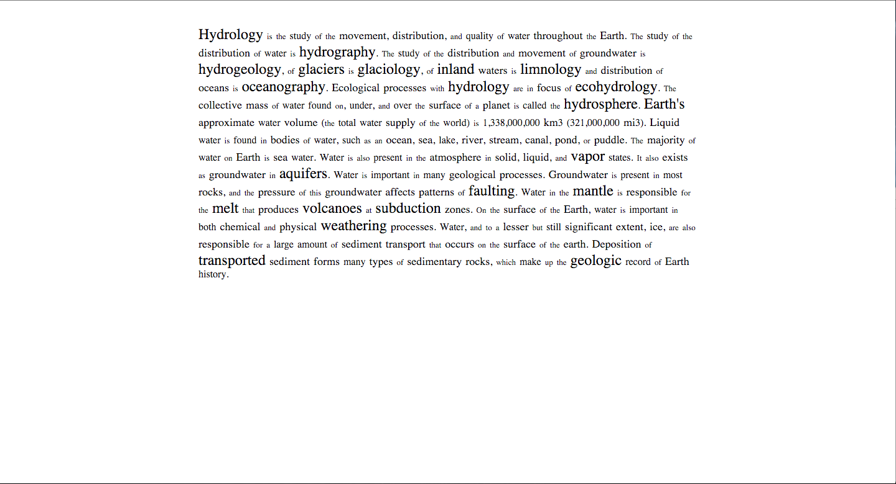

#Hi, this is Noteify!
Save precious study seconds by making your text do all the work.

This web app optimizes reading efficiency and study recall by analyzing input text for significance on a word-by-word basis. Words are evaluated based on their frequency in the English language, and consequently assigned a score. More uncommon words are then blown up in physical text size to make them stand out, while more common words remain smaller.

To run this website with Flask, just cd into this folder and run:
 
$ python app.py
 
It will be available on http://localhost:5000/

If you haven’t installed pip:
 
$ sudo easy_install pip
 
If you run into an error with OS permissions:
 
$ sudo chown -R $USER /Library/Python/2.7
 
To download Flask (terminal instructions only):
 
$ pip install Flask

Screenshots:
 

 

 

